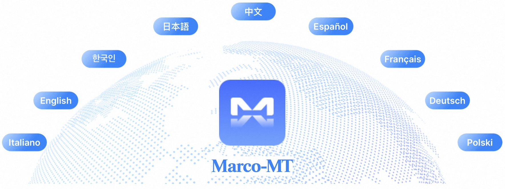
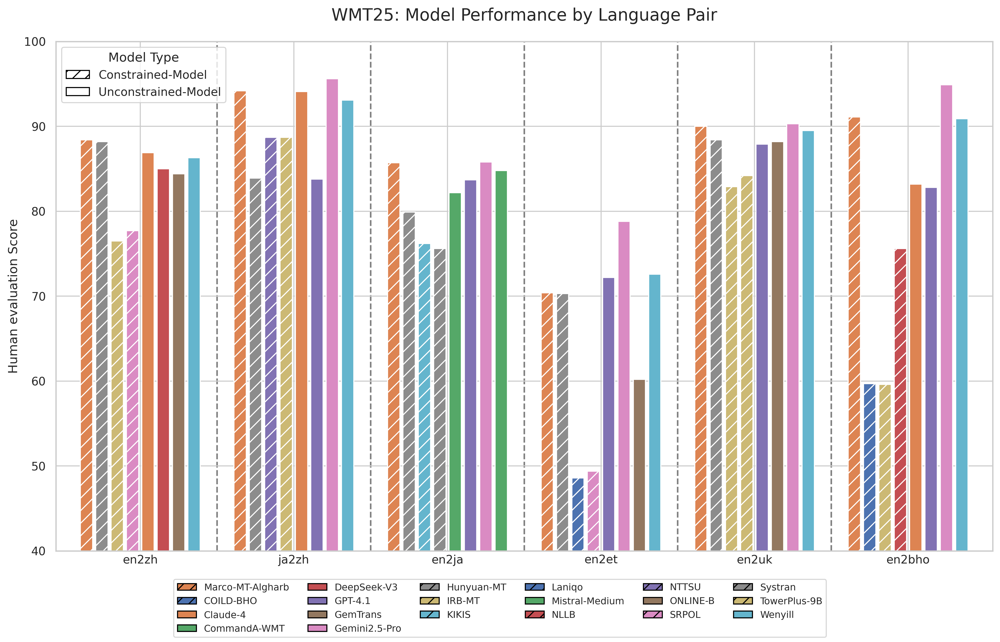

<!-- <div align="center">

<a href="https://www.aidc-ai.com/marcomt">

</a> -->

<p align="center">
    
<p>

# Marco-MT: Large Translation Model

<h4 align="center">
<div align="center">
 


</h4>

⭐ [_**Alibaba International Digital Commerce**_](https://www.aidc-ai.com/marcomt) ⭐

:octocat: [**Github**](https://github.com/AIDC-AI/Marco-MT)&nbsp;&nbsp;🤗 [**Hugging Face**](https://huggingface.co/AIDC-AI/Marco-MT-Algharb)&nbsp;&nbsp;📝 [**Paper**](https://www2.statmt.org/wmt25/pdf/2025.wmt-1.33.pdf)&nbsp;&nbsp;📽️ [**Demo**](https://huggingface.co/spaces/AIDC-AI/Marco-MT-Algharb)&nbsp;&nbsp; <a href="https://modelscope.cn/models/AIDC-AI/Marco-MT-Algharb"><b>ModelScope</b>

<!-- <a href="https://github.com/AIDC-AI/Marco-MT"></a><a href="https://huggingface.co/AIDC-AI/Marco-MT-Algharb"></a><a href="https://www2.statmt.org/wmt25/pdf/2025.wmt-1.33.pdf"></a><a href="https://huggingface.co/spaces/AIDC-AI/Marco-MT-Algharb"></a> -->

</div>

## Marco-MT-Algharb

This repository contains the system for Algharb, the submission from the Marco Translation Team of Alibaba International Digital Commerce (AIDC) to the WMT 2025 General Machine Translation Shared Task.

## Introduction

The Algharb system is a large translation model built based on the Qwen3-14B foundation. It is designed for high-quality translation across 13 diverse language directions and demonstrates state-of-the-art performance. Our approach is centered on a multi-stage refinement pipeline that systematically enhances translation fluency and faithfulness.

## Highlights

🏆 **WMT 2025 Dominant Performance**
Secured **12 medals** (6 🥇, 4 🥈, 2 🥉) across 13 contested language pairs, demonstrating state-of-the-art capabilities.

🚀 **Breakthrough in EN→ZH Translation**

Achieved **Rank #1** in the highly competitive English→Chinese direction, outperforming human translators, GPT-4.1, and Claude-4.

💡 **Core Technical Innovations**
* A two-stage SFT (Supervised Fine-Tuning) pipeline enhanced with **$CPO/M^2PO$** reinforcement learning.
* A **hybrid decoding** strategy integrating word alignment and MBR (Minimum Bayes Risk).

## Performance
In the WMT 2025 evaluation, our Marco-MT-Algharb system demonstrated exceptional performance. Notably, in the English-to-Chinese general translation task, our system ranked #1, outperforming leading AI systems like GPT-4.1 and Claude-4.
<div align='center'>

</div>

## Usage
The model expects a specific instruction format for translation. The following example demonstrates how to construct the prompt and perform generation using the vllm library for efficient inference.

Supported language pairs:
| Languages pair | Chinese Names |
|---|---|
| en2zh |  英语到中文 |
| en2ja |  英语到日语 |
| en2ko |  英语到韩语 |
| en2ar |  英语到阿拉伯语 |
| en2et |  英语到爱沙尼亚语 |
| en2sr_latin |  英语到塞尔维亚语(拉丁化) |
| en2ru |  英语到俄语 |
| en2uk |  英语到乌克兰语 |
| en2cs |  英语到捷克语 |
| en2bho |  英语到博杰普尔语 |
| cs2uk |  捷克语到乌克兰语 |
| cs2de |  捷克语到德语 |
| ja2zh |  日语到中文 |


### 1. Dependencies

First, ensure you have the necessary libraries installed:

```bash
pip install torch transformers==4.55.0 vllm==0.10.0 unbabel-comet==2.2.2
```

### 2. Prompt Format and Decoding

The core of the process involves formatting the input text into a specific prompt template and then using the vllm engine to generate translations. For our hybrid decoding strategy, we generate multiple candidates (n > 1) for later re-ranking.
The prompt template is:

```python
"Human: Please translate the following text into {target_language}: \n{source_text}<|im_end|>\nAssistant:"
```

Here is a complete Python example:
```python
from vllm import LLM, SamplingParams

model_path = "AIDC-AI/Marco-MT-Algharb"
llm = LLM(model=model_path)

source_text = "This paper presents the Algharb system, our submission to the WMT 2025."
source_lang_code = "en" 
target_lang_code = "zh"

lang_name_map = {
    "en": "english"
    "zh": "chinese",
    "ko": "korean",
    "ja": "japanese",
    "ar": "arabic",
    "cs": "czech",
    "ru": "russian",
    "uk": "ukraine",
    "et": "estonian",
    "bho": "bhojpuri",
    "sr_latin": "serbian",
    "de": "german",
}

target_language_name = lang_name_map.get(target_lang_code, "the target language")

prompt = (
    f"Human: Please translate the following text into {target_language_name}: \n"
    f"{source_text}<|im_end|>\n"
    f"Assistant:"
)

prompts_to_generate = [prompt]
print("Formatted Prompt:\n", prompt)

sampling_params = SamplingParams(
    n=1,
    temperature=0.001,
    top_p=0.001,
    max_tokens=512
)

outputs = llm.generate(prompts_to_generate, sampling_params)

for output in outputs:
    generated_text = output.outputs[0].strip()
    print(f"translation: {generated_text}")
```

## Apply MBR decoding
First, run random sample decoding:
```python
from vllm import LLM, SamplingParams

model_path = "path/to/your/algharb_model"
llm = LLM(model=model_path)

source_text = "This paper presents the Algharb system, our submission to the WMT 2025."
source_lang_code = "en" 
target_lang_code = "zh"

lang_name_map = {
    "en": "english"
    "zh": "chinese",
    "ko": "korean",
    "ja": "japanese",
    "ar": "arabic",
    "cs": "czech",
    "ru": "russian",
    "uk": "ukraine",
    "et": "estonian",
    "bho": "bhojpuri",
    "sr_latin": "serbian",
    "de": "german",
}

target_language_name = lang_name_map.get(target_lang_code, "the target language")


prompt = (
    f"Human: Please translate the following text into {target_language_name}: \n"
    f"{source_text}<|im_end|>\n"
    f"Assistant:"
)

prompts_to_generate = [prompt]
print("Formatted Prompt:\n", prompt)

sampling_params = SamplingParams(
    n=100,
    temperature=1,
    top_p=1,
    max_tokens=512
)

outputs = llm.generate(prompts_to_generate, sampling_params)

# The 'outputs' list contains one item for each prompt.
for output in outputs:
    prompt_used = output.prompt
    print(f"\n--- Candidates for source: '{source_text}' ---")
    
    # Each output object contains 'n' generated sequences.
    for i, candidate in enumerate(output.outputs):
        generated_text = candidate.text.strip()
        print(f"Candidate {i+1}: {generated_text}")
```
Then, run MBR decoding:
```bash
comet-mbr -s src.txt -t mbr_sample_100.txt -o mbr_trans.txt --num_samples 100 --gpus 1 --qe_model Unbabel/wmt22-cometkiwi-da
```
Note: Word alignment for MBR reranking will be available soon. 

## Citation
```bibtex
@InProceedings{wang-EtAl:2025:WMT,
  author    = {Wang, Hao  and  Xu, Linlong  and  Liu, Heng  and  Liu, Yangyang  and  Zhao, Xiaohu  and  Zeng, Bo  and  Wang, Longyue  and  Luo, Weihua  and  Zhang, Kaifu},
  title     = {Marco Large Translation Model at WMT2025: Transforming Translation Capability in LLMs via Quality-Aware Training and Decoding},
  booktitle      = {Proceedings of the Tenth Conference on Machine Translation (WMT 2025)},
  month          = {November},
  year           = {2025},
  address        = {Suzhou, China},
  publisher      = {Association for Computational Linguistics},
  pages     = {587--593},
  url       = {https://aclanthology.org/2025.wmt-1.33}
}
 
@article{wang2025beyond,
  title={Beyond Single-Reward: Multi-Pair, Multi-Perspective Preference Optimization for Machine Translation},
  author={Wang, Hao and Xu, Linlong and Liu, Heng and Liu, Yangyang and Zhao, Xiaohu and Zeng, Bo and Shao, Liangying and Wang, Longyue and Luo, Weihua and Zhang, Kaifu},
  journal={arXiv preprint arXiv:2510.13434},
  year={2025}
}
```

## License


This model is released under the **Apache License 2.0**. You can find the full license text [](https://www.apache.org/licenses/LICENSE-2.0.txt).

## Disclaimer
We used compliance checking algorithms during the training process, to ensure the compliance of the trained model(s) to the best of our ability. Due to complex data and the diversity of language model usage scenarios, we cannot guarantee that the model is completely free of copyright issues or improper content. If you believe anything infringes on your rights or generates improper content, please contact us, and we will promptly address the matter.

<a href="https://www.aidc-ai.com/marcomt">

</a>
